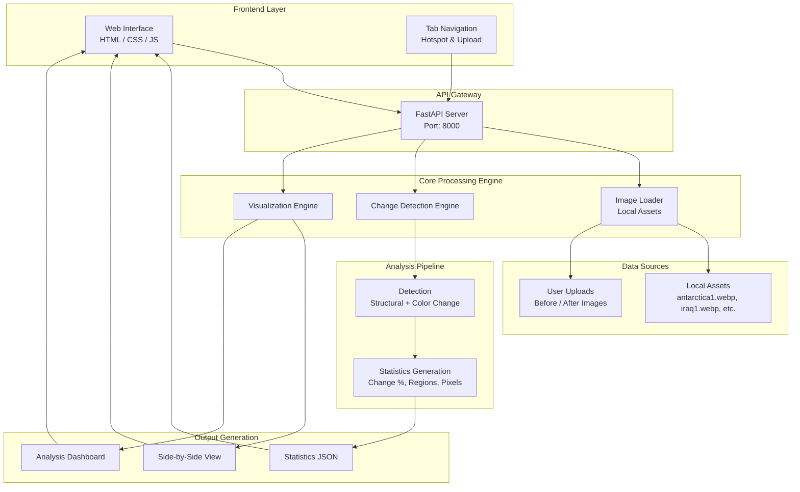

# ReFlecta - SAR Analysis Platform

**ReFlecta** is a real-time satellite image change detection and analysis platform that uses computer vision to identify and visualize environmental changes over time. The system analyzes before-and-after images from various global locations including Antarctica glaciers, deforestation areas, oil spills, ports, and military installations.

## Architecture Overview




### Step 3: Install Backend Dependencies
```bash
cd backend
pip install -r requirements.txt
```

### Step 4: Verify Assets Directory
Ensure the `assets/` directory contains the required image files:
```bash
ls assets/
# Should show: antarctica1.webp, antarctica2.webp, iraq1.webp, iraq2.webp, etc.
```

### Step 5: Start the Backend Server
```bash
python main.py
```
The backend API will be available at: `http://localhost:8000`

### Step 6: Start the Frontend
Open a new terminal and navigate to the project root:
```bash
# From the project root directory
python -m http.server 3000
```
The frontend will be available at: `http://localhost:3000`

### Step 7: Access the Application
1. Open your web browser
2. Go to `http://localhost:3000`
3. Use the ReFlecta interface to:
   - Select from 10 predefined global hotspots (Antarctica, Iraq, Rotterdam Port, etc.)
   - Upload your own before/after images for custom analysis
   - View detailed change detection results with statistics and visualizations

## API Endpoints
- `GET /` - API information and available endpoints
- `GET /health` - Health check and system status
- `GET /hotspots` - Available predefined analysis locations
- `POST /analyze` - Analyze changes for selected hotspot location
- `POST /upload-analyze` - Analyze user-uploaded before/after images
- `GET /test-images` - Test endpoint to verify image loading
- `GET /docs` - Interactive API documentation (Swagger UI)

## Features
- **Multi-Algorithm Change Detection**: Uses SSIM, perceptual color analysis, and GMM for accurate detection
- **Predefined Hotspots**: Analyze 10+ global locations (Antarctica, Iraq, Rotterdam Port, etc.)
- **Smart Filtering**: Ignores minor variations and focuses on significant changes
- **Advanced Visualization**: Side-by-side comparisons and comprehensive analysis dashboards
- **Upload Support**: Analyze your own before/after images with the same algorithms
- **Detailed Statistics**: Change percentages, affected regions, and pixel-level analysis
- **Noise Reduction**: Advanced post-processing to eliminate false positives
- **Consensus Voting**: Multiple algorithms vote on changes for improved accuracy

## Technologies Used
- **Backend**: FastAPI, Python 3.8+, OpenCV, NumPy, SciPy, Matplotlib, Pillow
- **Frontend**: HTML5, JavaScript (ES6+), Tailwind CSS, Custom CSS
- **Computer Vision**: OpenCV for image processing, SSIM for structural analysis
- **Data Source**: Local image assets, user uploads (JPEG, PNG, WEBP, TIFF)
- **API Documentation**: Swagger UI (FastAPI auto-generated)
- **Image Processing**: Multi-algorithm pipeline with consensus voting


## 🧠 Tech Stack

### Frontend


### Backend


### Deployment


### Development & Tools

